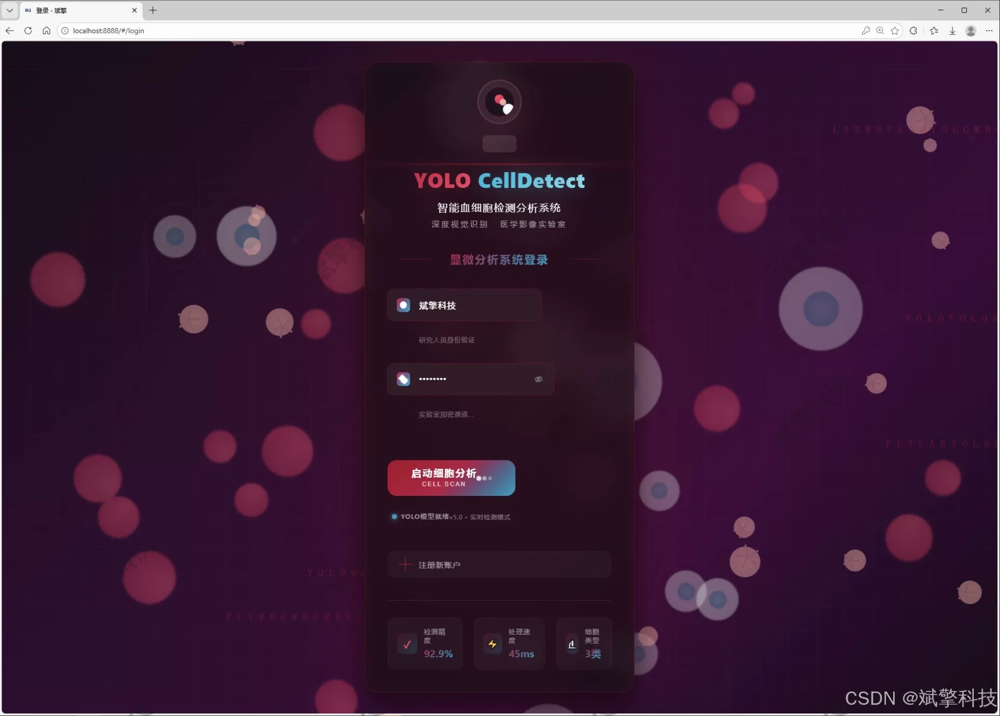
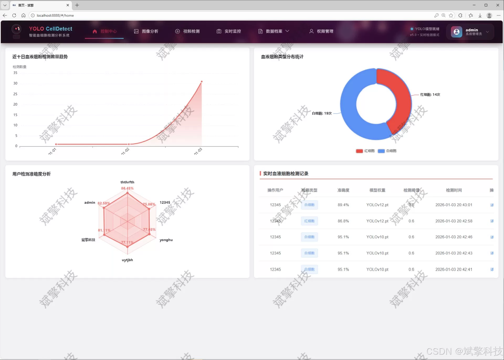
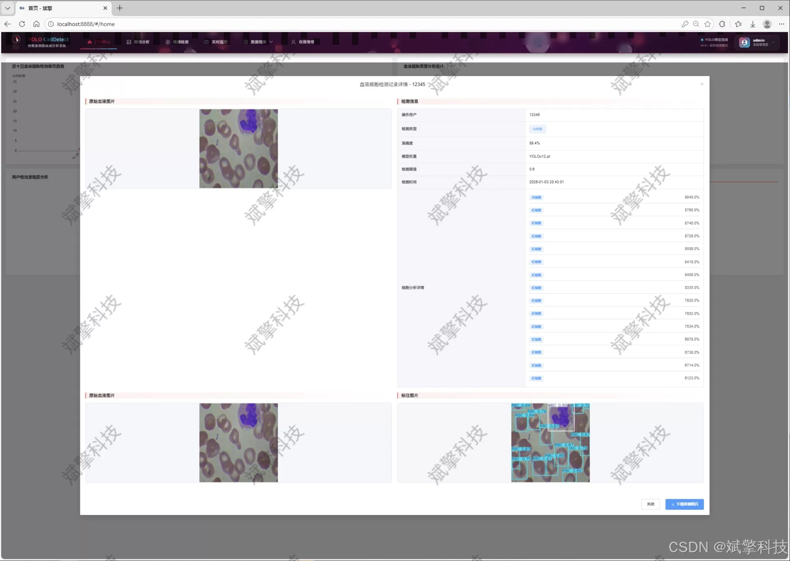
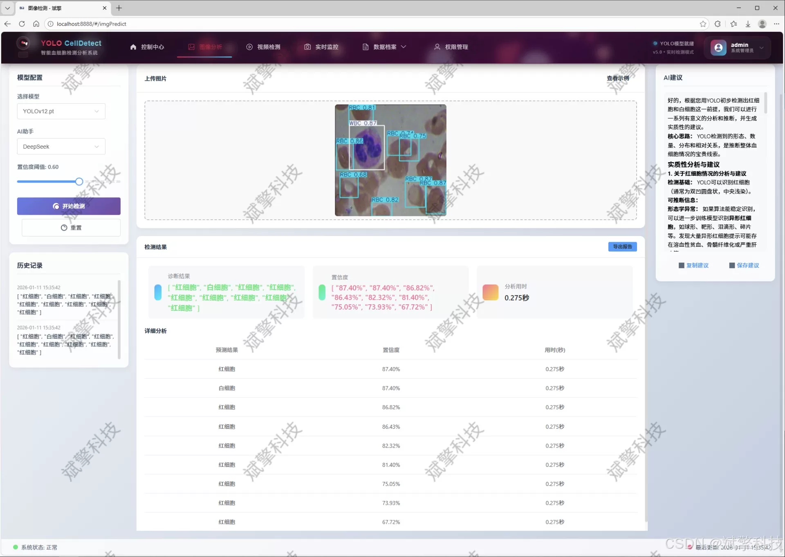
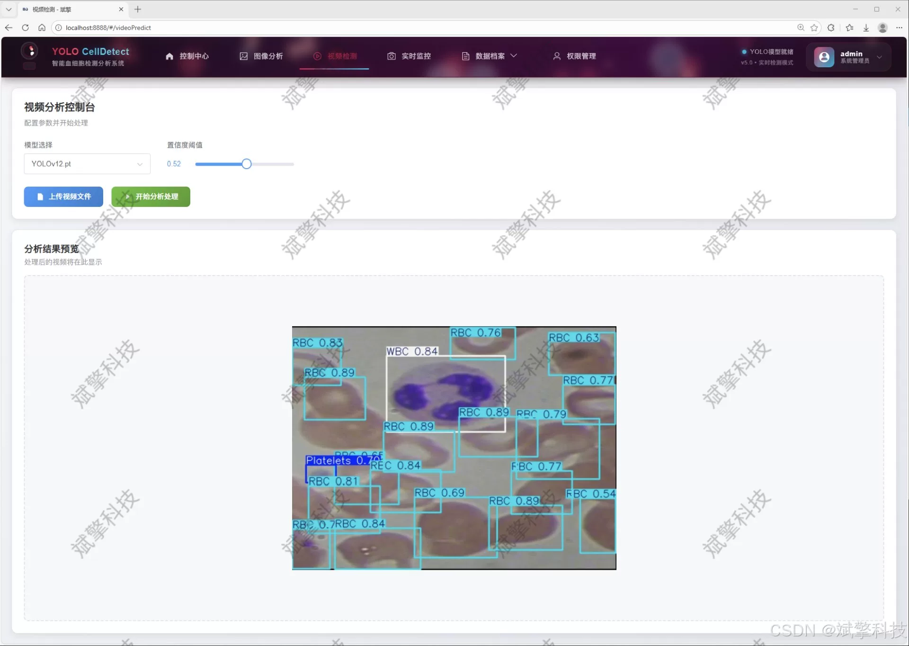
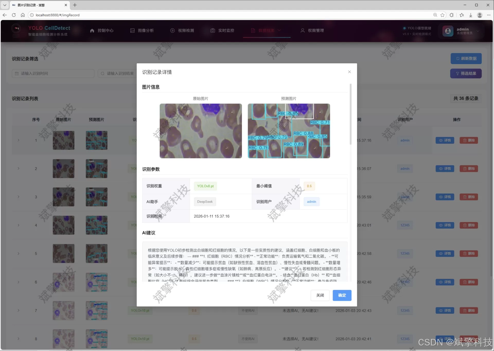
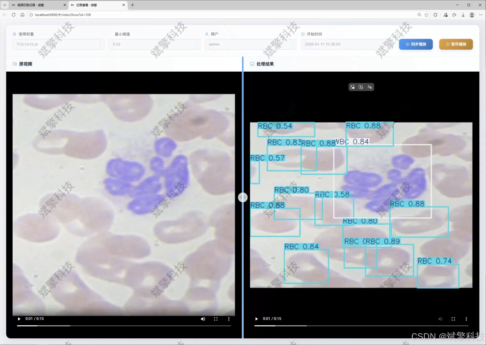
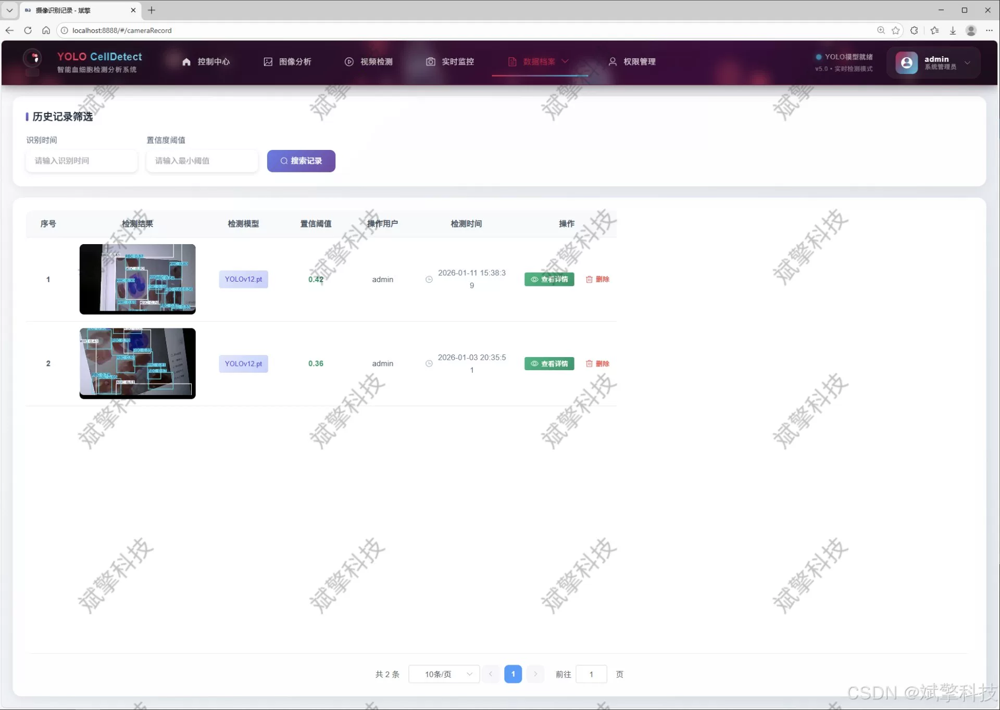
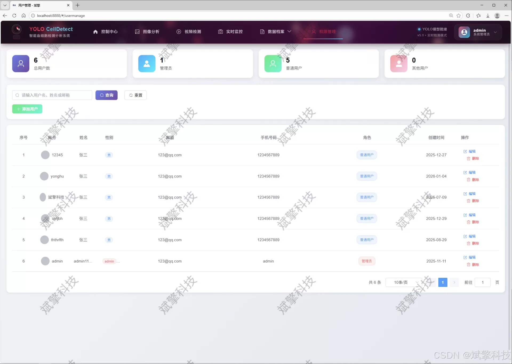

# Based on YOLO deep learning and the big models of Qianwen, DeepSeek, platelets...

## Body

This project aims to design and implement an automated blood cell detection and intelligent analysis system based on advanced deep learning technology and modern web frameworks. The core of the system integrates the latest evolution versions of the YOLO (You Only Look Once) target detection model series - YOLOv8, YOLOv10, YOLOv11, and YOLOv12, building a high-precision, high-efficiency tri-classification detection model for platelets (Platelets), red blood cells (RBC), and white blood cells (WBC). The model has been thoroughly trained and optimized on a specific domain dataset (containing a training set of 765 images, a validation set of 73 images, and a test set of 36 images), allowing it to accurately locate and identify various types of blood cells under a microscope.

The backend is built using SpringBoot framework, implementing high-performance RESTful API services to ensure clear and stable business logic. The frontend uses modern web technologies to construct an intuitive and friendly interaction interface, realizing true separation of concerns between the backend and frontend, enhancing the system's maintainability and scalability. The database is selected as MySQL for persistent storage of user information, model configuration, and massive detection records and results.

The innovativeness and practicality of this system are reflected in the following aspects: First, it provides multi-model switching functionality, allowing users to flexibly choose the optimal YOLO version for inference based on different precision and speed requirements. Second, it deeply integrates the intelligence analysis capabilities of the DeepSeek large language model, generating professional and easy-to-understand text descriptions and health recommendations after detection, significantly enhancing the level of intelligence of the system. Third, the system is fully functional, supporting diverse detection modes such as image, video files, and real-time streams from cameras, along with a comprehensive data management back end including modules for user login registration, personal center, and administrator management of user accounts and detection records. Fourth, it achieves comprehensive information and data visualization, presenting abstract detection data in charts and other forms to assist users in in-depth analysis.

Functional modules include:
✅ User login registration: Supports password authentication and saves to MySQL database.
✅ Supports four YOLO models switches, YOLOv8, YOLOv10, YOLOv11, YOLOv12.
✅ Information and data visualization.
✅ Image detection support AI analysis functions, deepseek and Qianwen.
✅ Supports image detection, video detection, and real-time camera detection, with detection results saved to MySQL database.
✅ Image recognition record management, video recognition record management, and camera recognition record management.
✅ User management module, allowing administrators to add, delete, update, and view user accounts.
✅ Personal center, where users can modify their information, password, name, profile picture, etc.

No lunwen writing services or any lunwen

## Images

## Payment

Here is a pay link on Stripe ( https://buy.stripe.com/3cs8yP7sY87d0vu9AB ). Please contact me lonlonago@foxmail.com after funding $89, and I will send you a complete data files , thank you!

